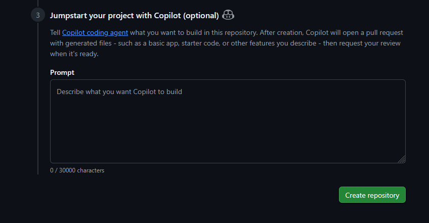
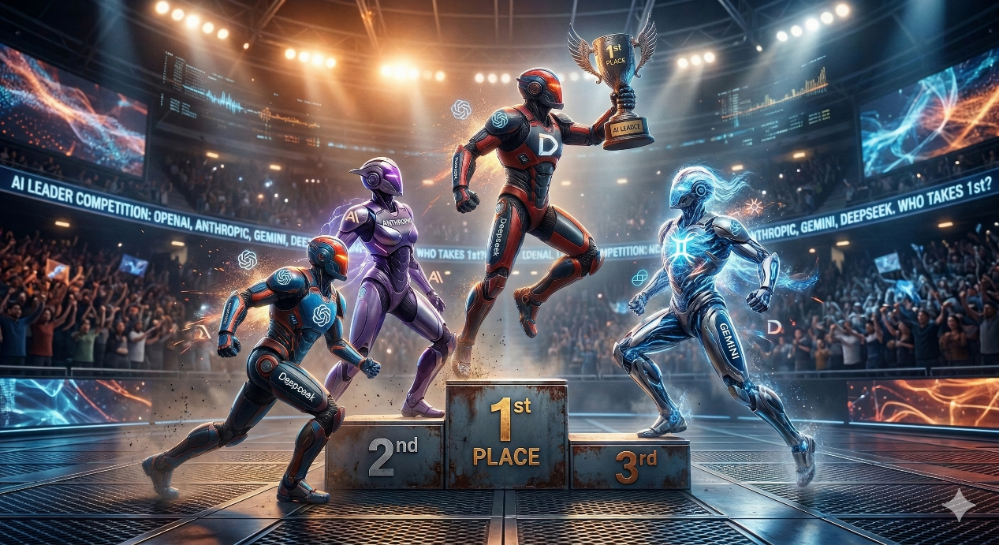
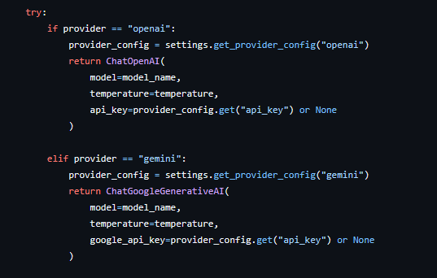
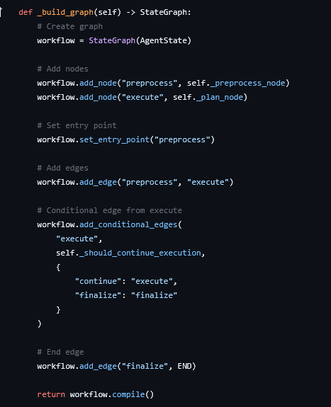
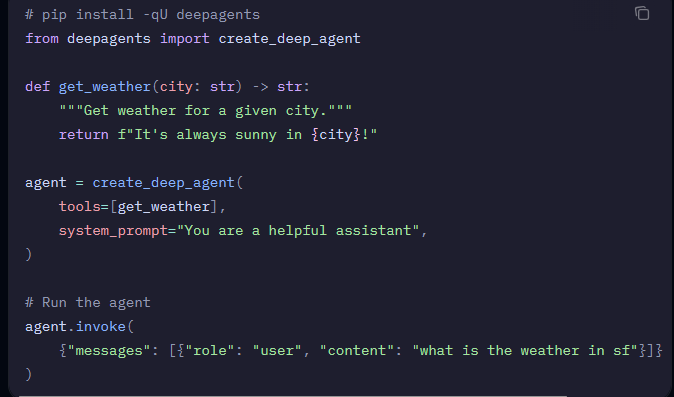
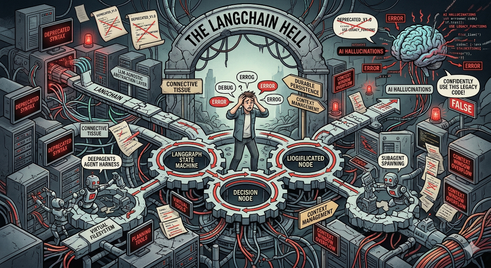

# Riding the DeepAgent Wave

The landscape of software development is undergoing a seismic shift. We are moving away from the meticulous, manual composition of line-by-line syntax and entering the era of high-level orchestration, often colloquially termed "Vibe Coding."

This isn't about abandoning logic or embracing laziness; rather, it's a fundamental evolution in how we interact with technology.

By leveraging tools like GitHub Copilot, autonomous agents, and orchestration frameworks, the developer's role is changing. Today, the "vibe"-the architectural intent and the desired outcome-is becoming the primary driver of production, while the AI handles the heavy lifting of execution.

## The Age of (Hybrid) Vibe Coding

My personal entry into this new paradigm didn't start with a desire to test cutting-edge software, it started with a terrifying hardware crisis.

While working on my RepRap 3D printer an external MOSFET failed in a closed-circuit mode. This meant the temperature of the heating element began to climb uncontrollably. Because the failure was physical, the printer's firmware was entirely powerless to stop it. The only thing standing between my home and a fire was physically shutting down the power supply.

To prevent this from happening again, I decided to wire the printer to a smart switch, allowing for an automated power cutoff if the sensors detected a runaway thermal event. I created a new repository, [octo-fire-guard](https://github.com/rdar-lab/octo-fire-guard), to build this safety utility. While the project itself wasn't an AI agent, its creation was my catalyst. I decided to test the waters with the GitHub Copilot agent, describing the safety protocol and the required hardware integration in plain English. The result was staggering. The agent effortlessly handled the boilerplate and mapped out the logic, proving to me just how thin the barrier between "intent" and "execution" had become. Moreover, the work that Microsoft/Github did with integrating Copilot with the issues and PRs is amazing. I could actually assign it issues and provide it feedback via code review comments, resulting in cycles of iterations till the result was just right.

Inspired by this success, I began utilizing AI for more routine, trivial automation tasks, leading to the creation of [ai-file-organizer](https://github.com/rdar-lab/ai-file-organizer). However, I wanted to push the boundaries further. To truly understand the current state of autonomous systems, I dove headfirst into [ai-book-composer](https://github.com/rdar-lab/ai-book-composer). This project was a trial by fire, forcing a direct confrontation with the complexities of orchestration frameworks, the nuances of deep agent implementations, and the wildly varying capabilities of modern Large Language Models.

## It is All About the Model

When you transition from standard coding to building autonomous agents, the foundational model you choose ceases to be just a glorified autocomplete. It becomes the reasoning engine of your entire application.

It is the core logic processor that must decide which tool to call, how to interpret the result, and what subsequent steps to take to achieve the user's goal.

If this engine lacks reasoning depth or fails to adhere to strict formatting, the entire system collapses, regardless of how elegant your underlying architecture might be.

My journey to finding the right "brain" for my projects was an eye-opening expedition through the current landscape of AI, revealing that not all models are created equal when it comes to agentic workflows:

- Ollama: A fantastic starting point for local, privacy-focused experimentation. However, when pushed into agentic workflows, it struggled significantly with tool calling. For agents that need to reliably output strict JSON to interact with external functions, local models often lack the necessary precision and consistency. I spent hours trying the make the tool-calling with Ollama work using my 16GB gaming GPU as the infrastructure to run it, with no luck.
- Gemini: A highly capable middle ground. It performs moderately well across most general tasks and boasts an impressive context window, but for highly complex logical branching and autonomous decision-making, it sometimes lacked the sharp reasoning spark found in more specialized models.
- Anthropic (Claude 3.5 Sonnet/Opus): Currently the gold standard for reasoning and coding. Its ability to follow complex instructions and execute flawless tool calls is amazing. However, that premium performance comes with a premium price tag, making high-frequency iteration and testing incredibly expensive.
- DeepSeek: The current disruptor in the space. It provides a highly intelligent, budget-friendly alternative that genuinely rivals the "prime" models in reasoning capabilities. For developers looking to balance deep intelligence with token economy, DeepSeek is currently proving to be the optimal choice.

## The LangChain Hell

If the LLM is the brain of your agent, frameworks like LangChain, LangGraph, and specific agent implementations are the nervous system. They route the thoughts, manage the memory, and dictate the flow of execution.

To understand why this nervous system is both incredibly powerful and frequently frustrating, we need to break down what these components actually do in an agentic architecture:

### 1\. LangChain: The Connective Tissue

At its core, LangChain is the foundational toolkit. It provides the standard interfaces required to connect your LLM to other essential components, such as prompt templates, memory stores, and external APIs. It is designed for linear, predictable workflows.

Crucially, LangChain is LLM-agnostic. This is a massive win for developers. Instead of tightly coupling your application to a specific vendor's SDK, LangChain acts as a unified abstraction layer. You can write your entire application logic once, and simply switch the underlying LLM vendor (from OpenAI to Anthropic, or Gemini to DeepSeek) at the implementation layer by changing a single line of code. You are never locked into a single provider.

Here is a simple example of how LangChain abstracts the LLM layer, allowing you to swap models without changing your core logic:

### 2\. LangGraph: The State Machine

While LangChain is great for linear tasks, true agents require autonomy. Agents need to think, act, observe the result of that action, and think again-which means they require loops. LangGraph is an orchestration framework built on top of LangChain designed specifically to handle these cyclical, multi-step workflows using a graph architecture of nodes and edges.

Here is a simple example of how LangGraph allows you to create a state machine that can loop and make decisions based on LLM outputs:

### 3\. The deepagents Library: The Engine of Autonomy

While LangGraph gives you the raw materials to build complex state machines, the specific [deepagents](https://www.google.com/search?q=%5Bhttps://docs.langchain.com/oss/python/deepagents/overview%5D%28https://docs.langchain.com/oss/python/deepagents/overview%29) library is much more than a simple wrapper. With the right tools, memory, compression, and prompts, this library automates creating an AI agent that can be as capable as a GitHub coding agent on any generic tool.

It solves the most difficult problems in agent design out-of-the-box by providing these core capabilities:

- Planning and task decomposition: Deep agents include a built-in write_todos tool that enables agents to break down complex tasks into discrete steps, track progress, and adapt plans as new information emerges.
- Context management: File system tools (ls, read_file, write_file, edit_file) allow agents to offload large context to in-memory or filesystem storage, preventing context window overflow and enabling work with variable-length tool results.
- Pluggable filesystem backends: The virtual filesystem is powered by pluggable backends that you can swap to fit your use case. Choose from in-memory state, local disk, LangGraph store for cross-thread persistence, sandboxes for isolated code execution (Modal, Daytona, Deno), or combine multiple backends with composite routing. You can also implement your own custom backend.
- Subagent spawning: A built-in task tool enables agents to spawn specialized subagents for context isolation. This keeps the main agent's context clean while still going deep on specific subtasks.
- Long-term memory: Extend agents with persistent memory across threads using LangGraph's Memory Store. Agents can save and retrieve information from previous conversations.

Here is a simple example on how to use the deepagents library to create a simple agent that can read and write files, plan tasks, and manage context:

With all it's power, this ecosystem is currently in a state of hyper-evolution, leading to an experience that can only be described as "documentation hell."

The sheer velocity of change in these libraries means that documentation is often stale within months, or even weeks, of publication. This creates an incredibly frustrating environment for developers trying to build stable systems:

- Stale Docs: You spend hours reading official documentation, only to realize the examples reference deprecated syntax that throws errors on compilation.
- AI Hallucinations: Because LLMs are trained on historical data, they are essentially blind to a library's update released yesterday. They will confidently suggest "legacy" code that no longer functions with your current environment.
- The Ambiguity Tax: Using these tools requires a massive tolerance for ambiguity, a high learning curve, and the patience to debug undocumented breaking changes in real-time.

## It is (Still) All About the Tooling

Even with the smartest model and the most robust framework, an agent is only as effective as the tools you give it. In the context of DeepAgents, "tooling" refers to the specific, bounded capabilities-the functions and APIs-you grant the LLM to interact with the outside world.

Giving an agent the wrong tools, or poorly optimized tools, is a recipe for disaster. I learned this the hard way during the development of the ai-book-composer:

- The "Full File" Trap: In my first iteration, I simply provided a tool that allowed the LLM to read entire files into its context. This approach was catastrophic. It generated massive, bloated context windows that confused the model's reasoning, caused execution failures, and consumed tokens like water spilling from a broken pipe.
- The RAG Pivot: Realizing the agent was drowning in information, I entirely refactored the tooling to use a Retrieval-Augmented Generation (RAG) approach.

Instead of feeding the agent raw, complete files, I built tools that allowed the agent to search for specific document segments based on semantic queries. This shift to highly granular, query-based tools resulted in a massive performance boost. It kept the context window clean, focused the agent's attention, and drastically lowered token consumption. It proved a vital lesson in agent design: providing an LLM with "too much" information is often far worse than providing "just enough.". Choosing the right tools can be the difference between a useless junk or an amazing gizmo.

## Will AI Replace Humans? The Dev Angle

Looking at the rapid advancement of these agentic systems, the inevitable question arises: are we coding ourselves out of a job? The future of the software development profession is best viewed through two distinct timelines:

### 1-5 Years: The Great Consolidation

In the near term, we are likely entering a period of workforce consolidation, particularly for Junior and Mid-level roles. When a single expert developer, armed with a team of DeepAgents, can comfortably handle the workload of three or four traditional engineers, companies will naturally reduce their reliance on entry-level staff. The risk to junior roles is immense, as the "trivial" coding tasks-the historical training ground for new developers-are the first to be fully automated. Conversely, Expert developers will see demand skyrocket. The industry will desperately need seasoned architects to design these complex agentic systems, supervise their logic, and ensure systemic integrity.

### 5+ Years: The Innovation Pivot

Looking further out, the actual day-to-day role of a "Developer" will undergo a complete metamorphosis, shifting almost entirely toward Innovation and System Design. The mechanical act of writing CRUD applications, basic APIs, and standard UI components will be handled autonomously by AI. The human developer's value will no longer be measured by syntax memorization, but by their ability to define the "why" and the "what." We will become directors of digital orchestras, focusing on user experience, business logic, and architectural vision, while the agents manage the complex mechanics of the "how."

The wave of AI-driven development is already crashing over the industry. You can either let it submerge you, or you can grab a board and learn to ride it.

